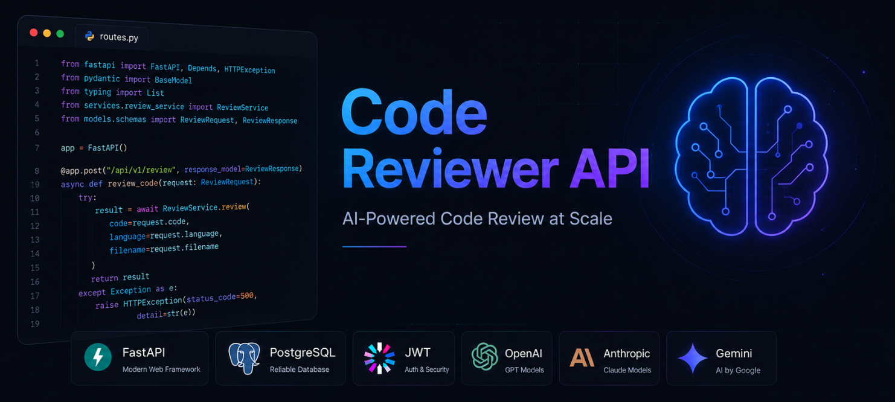
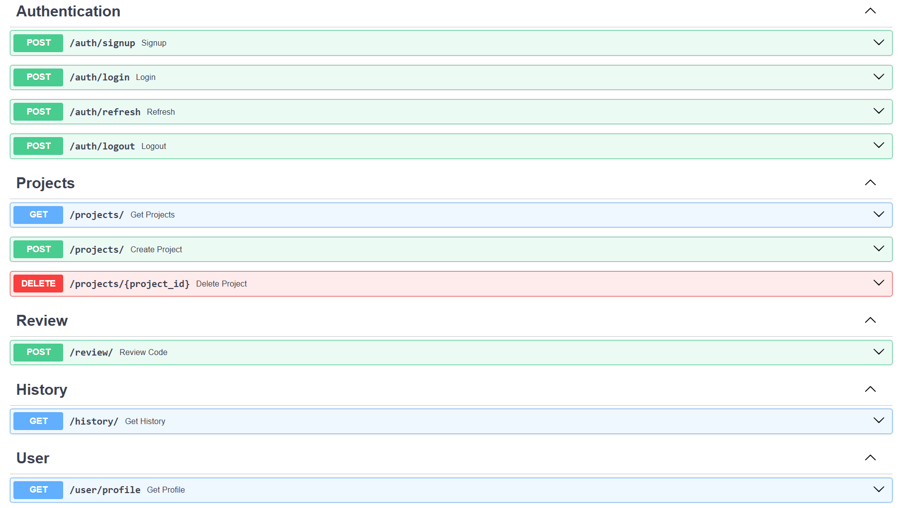

# Code Reviewer API

FastAPI backend for the Code Reviewer application. This API handles project management, user authentication, review history, and automated code review using AI.



## Overview

The Code Reviewer API provides a RESTful interface for:
- User authentication (signup, login, refresh tokens, logout) using secure HTTP-only cookies
- Creating, fetching, and deleting user projects
- Reviewing source code files using multiple AI models (Gemini, OpenAI, Anthropic) via a unified factory pattern
- Accessing user-specific code review history and profiles
- Rate limiting to ensure controlled AI usage

## Tech Stack

- **FastAPI**: Modern, fast web framework for building APIs
- **PostgreSQL**: Relational database for storing user data, project records, reviews, and active refresh tokens
- **Psycopg2**: PostgreSQL database adapter for Python
- **AI Models**: Support for Gemini, OpenAI, and Anthropic for intelligent code reviews
- **Passlib & bcrypt**: For secure password hashing
- **Python-jose**: For generating and validating JWT tokens (Access & Refresh tokens)
- **Pydantic**: Data validation using Python type annotations
- **Uvicorn**: ASGI server for running FastAPI

## Project Structure

```
Code-Reviewer-API/
├── main.py                  # FastAPI application and middleware setup
├── .env.example             # Example environment variables template
├── src/
│   ├── config/
│   │   └── settings.py      # Configuration and environment variable handling
│   ├── connection/
│   │   └── database.py      # PostgreSQL connection setup
│   ├── exceptions/
│   │   └── handlers.py      # Global exception handlers and custom HTTP exceptions
│   ├── middleware/
│   │   ├── auth.py          # Token-based authentication middleware
│   │   └── logging.py       # Logging middleware for API requests
│   ├── models/
│   │   ├── auth.py          # Auth request/response validation models
│   │   ├── project.py       # Project validation models
│   │   ├── review.py        # Code review request/response models
│   │   └── user.py          # User profile validation models
│   ├── respositories/
│   │   ├── file_repo.py     # File repository operations
│   │   ├── project_repo.py  # Project database operations
│   │   ├── review_repo.py   # Review history database operations
│   │   ├── token_repo.py    # Active refresh token database operations
│   │   └── user_repo.py     # User account database operations
│   ├── routers/
│   │   ├── auth.py          # Authentication endpoints (signup, login, logout, refresh)
│   │   ├── history.py       # Historical review retrieval endpoints
│   │   ├── projects.py      # Project management endpoints
│   │   ├── review.py        # AI code review endpoint
│   │   └── user.py          # User profile endpoint
│   ├── schema/
│   │   └── schema.sql       # Database schema for PostgreSQL tables
│   ├── security/
│   │   ├── cookies.py       # Helpers for setting and deleting JWT cookies
│   │   ├── dependencies.py  # FastAPI dependencies for auth
│   │   ├── hashing.py       # Password hashing utilities
│   │   └── jwt.py           # JWT generation and verification logic
│   ├── services/
│   │   ├── ai/              # AI services using a factory pattern
│   │   │   ├── ai_factory_pattern.py
│   │   │   ├── anthropic_service.py
│   │   │   ├── base.py
│   │   │   ├── gemini_service.py
│   │   │   └── openai_service.py
│   │   ├── auth_service.py   # Auth business logic
│   │   ├── history_service.py# Review history business logic
│   │   ├── project_service.py# Project business logic
│   │   └── review_service.py # Code review orchestrator and validation logic
│   └── utils/
│       ├── enums.py         # App-wide enumerations (e.g. AIProvider)
│       ├── helpers.py       # General helper utilities
│       ├── prompts.py       # AI prompts for code analysis
│       └── validators.py    # Code size and programming language validators
```

## Installation

### Prerequisites

- Python 3.8 or higher
- PostgreSQL database
- API key(s) for the chosen AI providers:
  - Gemini API Key
  - OpenAI API Key
  - Anthropic API Key

### Setup

1. **Create a virtual environment**:
```bash
python -m venv venv
source venv/bin/activate  # On Windows: venv\Scripts\activate
```

2. **Install dependencies**:
```bash
pip install fastapi uvicorn python-dotenv psycopg2-binary python-jose[cryptography] passlib[bcrypt] google-generativeai openai anthropic
```

3. **Configure environment variables**:
Create a `.env` file in the root directory and copy the contents from `.env.example`:
```env
PG_HOST=your_database_host
PG_PORT=5432
PG_DATABASE=your_database_name
PG_USER=your_database_username
PG_PASSWORD=your_database_password
PG_SSLMODE=require

JWT_SECRET_KEY=your_access_secret_key
JWT_REFRESH_SECRET_KEY=your_refresh_secret_key
JWT_ALGORITHM=HS256
JWT_EXPIRE_MINUTES=30
JWT_REFRESH_EXPIRE_DAYS=7

GEMINI_API_KEY=your_gemini_api_key
OPENAI_API_KEY=your_openai_key
ANTHROPIC_API_KEY=your_anthropic_key

COOKIE_DOMAIN=localhost
MAX_REVIEWS_PER_HOUR=5
```

4. **Initialize the Database**:
Run the SQL queries in `src/schema/schema.sql` on your PostgreSQL instance to set up the database tables (`Users`, `Projects`, `Reviews`, `RefreshTokens`).

## Running the Server

### Start the server (development):
```bash
uvicorn main:app --reload
```

The API will be available at `http://localhost:8000`

### Production mode:
```bash
uvicorn main:app --host 0.0.0.0 --port 8000
```

## API Documentation

Once the server is running, you can access:
- **Interactive API docs (Swagger)**: `http://localhost:8000/docs`
- **Alternative API docs (ReDoc)**: `http://localhost:8000/redoc`

## API Endpoints



## Configuration

### Environment Variables

| Variable | Description | Required | Default |
|----------|-------------|----------|---------|
| `PG_HOST` | PostgreSQL database host | Yes | - |
| `PG_PORT` | PostgreSQL database port | No | `5432` |
| `PG_DATABASE` | PostgreSQL database name | Yes | - |
| `PG_USER` | PostgreSQL database username | Yes | - |
| `PG_PASSWORD` | PostgreSQL database password | Yes | - |
| `PG_SSLMODE` | SSL Mode for PostgreSQL connection | No | `require` |
| `JWT_SECRET_KEY` | Secret key used for signing Access Tokens | Yes | - |
| `JWT_REFRESH_SECRET_KEY` | Secret key used for signing Refresh Tokens | Yes | - |
| `JWT_ALGORITHM` | Algorithm used for JWT encoding | No | `HS256` |
| `JWT_EXPIRE_MINUTES` | Access Token lifetime in minutes | No | `30` |
| `JWT_REFRESH_EXPIRE_DAYS` | Refresh Token lifetime in days | No | `7` |
| `GEMINI_API_KEY` | API Key for Google Gemini | No* | - |
| `OPENAI_API_KEY` | API Key for OpenAI | No* | - |
| `ANTHROPIC_API_KEY` | API Key for Anthropic | No* | - |
| `COOKIE_DOMAIN` | Domain for HTTP-only cookies | No | `localhost` |
| `MAX_REVIEWS_PER_HOUR` | Maximum review submissions per user per hour | No | `5` |

\* At least one AI Provider API Key is required based on the provider chosen during review.

### Session & Security Management

- **Dual-Token System**:
  - **Access Token**: Short-lived (30 minutes) token stored in secure, HTTP-only cookies for client authentication.
  - **Refresh Token**: Long-lived (7 days) token stored in the PostgreSQL database (`RefreshTokens` table).
- **Token Rotation**: When a token is refreshed, the old refresh token is immediately revoked/deleted, and a new access/refresh pair is generated and saved. This protects against replay attacks.
- **Revocation**: Logging out revokes the refresh token from the database, preventing future token rotations from that session.
- **Rate Limiting**: Restricts users to `MAX_REVIEWS_PER_HOUR` requests per hour, preventing resource overuse and controlling API costs.

## How It Works

### Authentication Flow

1. **Registration/Login**: Users register or authenticate. Upon successful password verification, JWT tokens are issued.
2. **HTTP-only Cookies**: The tokens are set as HTTP-only cookies to secure them against Cross-Site Scripting (XSS) attacks.
3. **Session Verification**: The `LoggingMiddleware` and custom authentication middleware verify the tokens on protected routes.
4. **Token Rotation**: The client refreshes the short-lived access token by sending the refresh token. The backend verifies the refresh token, revokes it, and issues a new pair.

### Code Review Flow

1. **API Call**: Client submits code along with the project context, file name, and preferred AI provider.
2. **Checks**: The system checks if the project belongs to the user, verifies that the code size is within limits, validates the file language/extension, and checks the hourly rate limit.
3. **AI Factory Orchestration**: The request is routed through `AIFactory`. The selected provider service (Gemini, OpenAI, or Anthropic) calls the respective API using a tailored prompt.
4. **Parsing & Formatting**: The model response is parsed from JSON and structured into ratings (`score`, `readability`, `accuracy`, etc.), bug lists, and optimized code recommendations.
5. **Persistence & Return**: The review is stored in the database and returned to the client.

## Dependencies

Key dependencies used in the project:

- `fastapi` - Web framework
- `uvicorn` - ASGI server
- `psycopg2-binary` - PostgreSQL database adapter
- `python-jose` - JWT encoding and decoding
- `passlib` - Password hashing utilities
- `bcrypt` - Hashing algorithm backend for Passlib
- `python-dotenv` - Environment variable loading
- `google-generativeai` - Google Gemini integration
- `openai` - OpenAI API integration
- `anthropic` - Anthropic Claude integration

## Error Handling

The API uses standard HTTP status codes:
- `200`: Success
- `400`: Bad Request (invalid file, code too large, unsupported format, etc.)
- `401`: Unauthorized (missing/invalid tokens)
- `403`: Forbidden (accessing projects/data belonging to other users)
- `429`: Too Many Requests (rate limit exceeded)
- `500`: Internal Server Error

All exceptions return JSON in the format:
```json
{
  "detail": "Error explanation message"
}
```